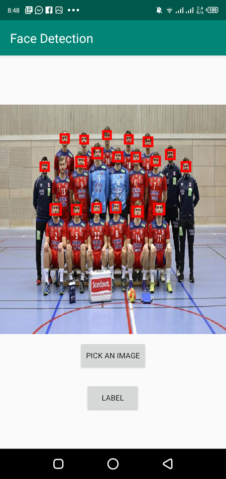
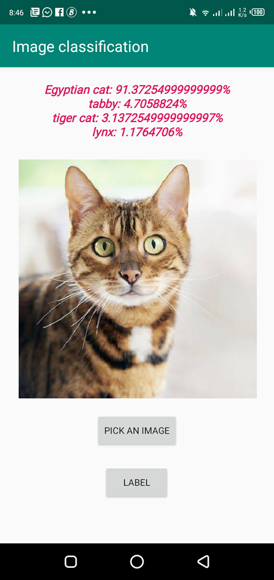

# TFLiteProjects

**Face detection application**

- By using TFLite Face detection API.

**Object classification application**

- By using a customly created model using ImageNet dataset and a convolution network.

